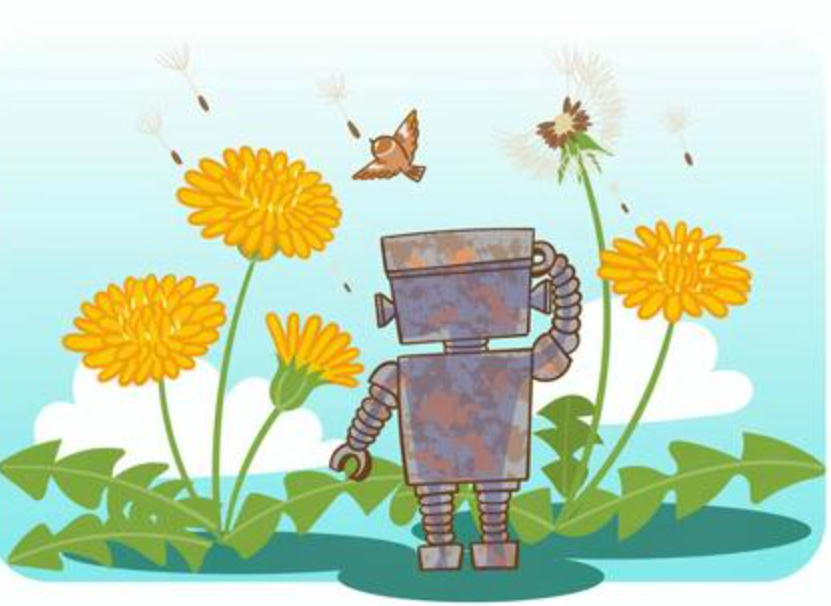

Hello!

I'm a fan of embedded systems 🚀, mobile robotics ✈️, and AI 💡. I am currently working on the application and development of computer vision algorithms to solve problems related to plant phenotyping 🌿 and crop status prediction 🥕 from aerial, satellite, and other environmental records 🌍.

I've also explored NLP 📚 for web review analysis and the recommendation of items and people of interest 🔑.

I am very interested in collaborating on a project related to the perception of aerial robots. If you have an idea or a project that you would like to develop, please contact me to discuss and maybe start coding!

My email: jprojas9206@gmail.com

By the way, I love the phrase from Benjamin that says, "The secret of success is constancy to purpose."

See you soon!

🐻